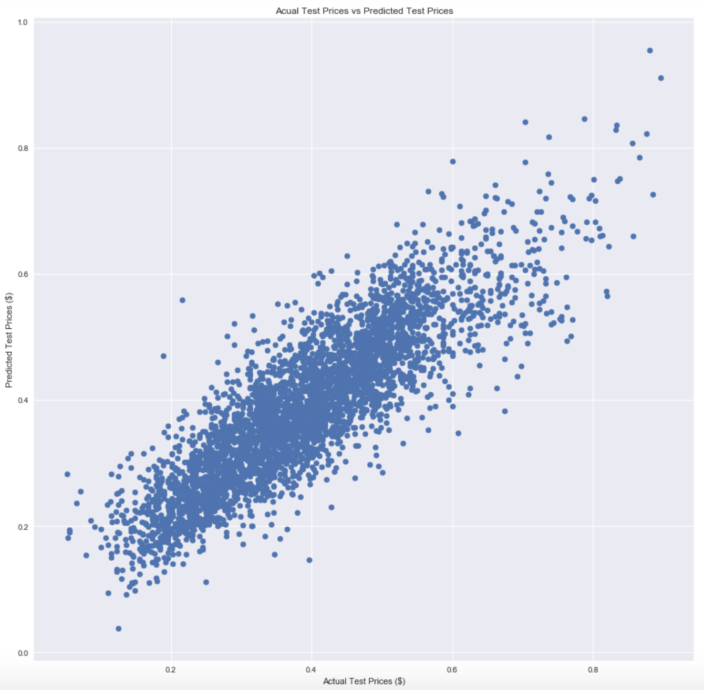

# Anubhav's King County Housing Regression Analysis

## Introduction

In this project, I explored the cycle of Data Science through the use of the King County Housing Data to help give Home Owners a spot on house price estimate for when they sell.

The packages necessary are loaded at the beginning of the notebook:

    import matplotlib.pyplot as plt
    %matplotlib inline
    import pandas as pd
    import numpy as np
    import seaborn as sns
    from seaborn import lmplot
    from scipy import stats
    import statsmodels.api as sm
    from sklearn import preprocessing
    from sklearn.model_selection import train_test_split
    from sklearn.metrics import mean_absolute_error
    from sklearn.metrics import mean_squared_error
    from sklearn.metrics import r2_score
    from sklearn.linear_model import LinearRegression
    from sklearn.datasets import make_friedman1
    from sklearn.feature_selection import RFE

## Question

Can we accurately predict housing sale price estimates and what are the best features that describe these prices?

Other questions answered:
On what day and in which season were most of these house bought?
Are the different grades located in specific locations?
Are the different group of price ranges 

## Overview of Data Set

The dataset provided was comprised of house sale prices for King County spanning over a year and the houses' descriptive variables. By the end of the project, I had cleaned the data, delt with the null values and missing data, binned and created categorical dummy variables, and feature engineering the rest (through log normalization and minmax scaling).

#### On what day and in which season were most of these house bought?

Throughout the week, most houses are bought during the beginning of the week. The best day to sell is on a Tuesday, whereas the worst day to sell is on a Sunday. Additionally, most houses are bought in the Spring or the Summer which may be because most people have the most time to move and figure out their affairs during those seasons. I would thus, recommend to finalize a deal leading up to on of the earlier days in the week and try to sell during the months of March-August.

#### Are the different group of price ranges

We can see that our higher priced houses are located near each other in the top of King County. I am unfamiliar with the area itself, but they could possibly have more space and are in better neighborhoods. The lower priced houses are mostly located in the bottom of King County, showing once again that neighborhood influences how price may be estimated. As for our middle priced houses, location varies and is spread across King County. These middle priced houses located in the richer part of the County could be smaller in size and reversely, these middle priced houses located in the poorer part of the County could be bigger in size.

#### Are the different grades located in specific locations?

We can see that higher graded houses are lumped together in a smaller section of the King County Area, whereas the middle grades are spread apart. Looking at both the price disperson graph above, it seems as though the higher graded houses are in similar locations as the higher priced houses, giving us another impression that grade is strongly descriptive of price.

## Exploratory Data Analysis

### Process

Throughout my EDA, I generally went through a simple process to finding my features:

Business Understanding, Data Mining, Data Cleaning, Feature Engineering, Predictive Modelling

#### Data Mining/Cleaning:
This process included deleting duplicates found in the ID column and getting rid of the ID column. I also changed each column to the appropriate data types for further manipulation. I looked at the linearity assumption and found that for the most part, most of our continous data experience some sort of linearity with the clear exception of sqft_lot, describing the square footage of the property. I found it difficult to approriately tell linearity exists since there are so many data points and they are very close to each other. However, since they experience some sort of linear relationship, I continued and later dropped the features that were most questionable regarding linearity.

For dealing with our placeholder values in sqft_basement, I used my knowledge that sqft_living accounted for entire living space including basement while sqft_above was the living space without the basement. Therefore, I subtracted the two for the rows without basement values and inputed the absolute value of the difference. Noticing that most of our houses don't have basements, I changed the feature to a boolean type, True if the house has a basement and False if it doesn't.

For dealing with out null values, I found that the majority, mean and median of view, yr_renovated and waterfront had value zero. Therefore, i filled the null values with zero. Aftwerwards, waterfront and yr_renovated was changed to a booelan type since there were only two values for waterfront and most of the yr_built values were unique. Since view was over 80% filled with zero values, I decided to drop the feature all together. 

At various moments in the notebook, I run a muticollinearity test to drop any features too correlated to each other.

#### Feature Engineering
Through this process, I did 3 major changes. They included data bining and creating dummies for our yr_built and zipcode features, normalizing and scaling our conitnous variables, and one hot encoding for the rest of our categorical data.

For years, I decided to group the houses based on changes in the economy for pre 90s houses and then group the houses by decades afterwards. Thus we split into Pre-World War 2 Era, Pre-80s Financial Recession, and afterwards split up into decades as most of the data resides during that period. For zipcodes, I simply split up into eight different groups spaced between 98001 and 98200. Afterwards, I created dummy variable categories and dropped the first to eliminate dummy variable trap.

Before normalizing and scaling our continuous data, I eliminated outliers from our bedrooms and bathrooms data. In our df.describe function used in the beginning of the notebook, the max values of both were incredibly high compared to the mean and our mean values of the were equal to the 25th percent quartile. Therefore, after running the notebook with different max cutoff values, I found it best to keep them with values from 25th percent quartile to a little over the 75th percent quartile. Our data included bedrooms between 5 and 2 and our bathrooms between 3.5 and 2.

I then one hot encoded the categorical data. For normalizing and scaling the continous data, I wanted to use yeo-johnson or box-cox method, however, too many variables were diving by zero and so I simply used log normalization and scaled using MinMax Scalar (which was helpful when inverting later predicted variables). We then check our Ktest values to make sure our features are normal

    sqft_above: KstestResult(statistic=0.5582888064256261, pvalue=0.0)
    sqft_living15: KstestResult(statistic=0.6391726639552585, pvalue=0.0)
    sqft_lot: KstestResult(statistic=0.5190848972305282, pvalue=0.0)
    sqft_lot15: KstestResult(statistic=0.5247564941540667, pvalue=0.0)
    lat: KstestResult(statistic=0.5558400209515666, pvalue=0.0)
    price: KstestResult(statistic=0.5422578505445189, pvalue=0.0)
    long: KstestResult(statistic=0.6476870680571643, pvalue=0.0)

#### Predictive Modelling

To start my modelling, I split my data using a train test split where test size is 33% of the data. I then used a a forward-backward selection algorithm given from learn.co found on data science stack exchange:
    https://datascience.stackexchange.com/questions/937/does-scikit-learn-have-forward-selection-stepwise-regression-algorithm
We drop the unnecessary features and run an OLS model using statsmodels.

## Results

### Summary of Model Statistics

    R-Squared of Train Set:
        0.774

    R-Squared of Test Set:
        0.758

    Train Mean Squared Error:
        0.00420

    Test Mean Squared Error:
        0.00427

    Difference of Mean Squared Errors:
        approximately 0.0

    Mean Absolute Error of Test Set:
        0.0500

    Root Mean Squared Error of Test Set:
        0.0654

    Average Actual Price:
        $591,276

    Average Predicted Price:
        $575,981

    Difference:
        $15,295
        
This model experienced a Test Set R-Squared of 0.758 meaning about 76% of variability of price was explained by our model. R-squared measureshow close the data is fitted regression line. We also have a Mean Squared Error of 0.00427 and a Root Mean Squared Error of 0.0645. Since we normalized and scaled our price values, these errors don't exp.ain much. However, after inverting our actual test prices and predicted test prices, we found that our Average Price Difference between actual and Predicted was $15,295, which is a 2.5% difference from our average actual price.

Below, we may see our actual test prices plotted versus our predicted. There are clearly errors in our plot points but the general shape is linear along the y=x line.

### Model Features Selected

After running the feature selection algorithm, we are left with these features with acceptable p-values at a 5% significant level:

#### Dummy Variables:

Grades between 7-13 -> categorical data

Zipcodes from 98021-98121 and 98141-98200

Years built from 1940 onwards

Conditions 4 and 5

Bedrooms 3.5 - 4

Bathrooms 3.25-3.5

2 floors

#### Continous Data:

Longitute and Latitude

Square Foot Lot (Square footage of property)

Square Foot Above (Square footage of house without the basement)

Square Foot Living 15 (Square footage of the houses of the 15 nearest neighbors)

#### Boolean Data:

Basement (Whether there is a basement in the house)

Waterfront (If it is near water)

Renovated (Whether the house was renovated)

### Five Most Descriptuve Features Using Recursive Feature Elimination

After making the model, we use recursive feature elimination from sklearn Linear Regression to select the highest ranked features from the features selected above in estimating housing prices.

We find that the five best features estimating price was: waterfront, sqft_above, sqft_living15, lat, grade_13.0.
This means the location of the house is very important, including near the water and the house sizes around the house itself. Additionally, having the best grade can strongly affect the price of your house.
